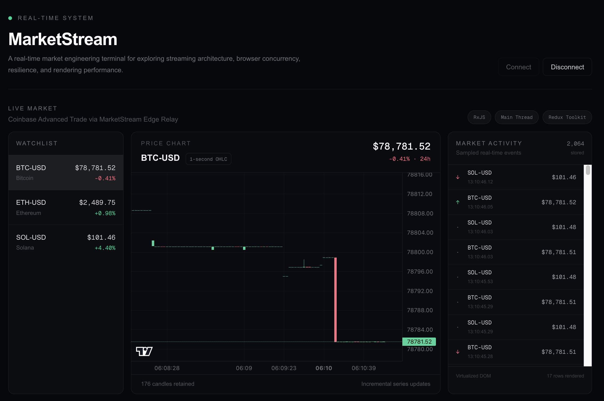

# MarketStream

[](...)

A real-time market engineering terminal for exploring streaming architecture, browser concurrency, resilience, and rendering performance.

MarketStream is not intended to be a trading product. It is an engineering project built to experiment with how a modern frontend can process, measure, and render high-frequency market data while keeping the UI responsive.



## Live Demo

**Production**

https://seibashonia.dev/work/market-stream

MarketStream is deployed as an independently built Next.js application and composed into the main portfolio using a route-based Multi-Zone architecture.

---

## What It Demonstrates

MarketStream focuses on several frontend engineering problems that commonly appear in real-time systems:

- WebSocket connection lifecycle and automatic reconnection
- High-frequency event processing
- RxJS buffering and stream composition
- Main Thread vs Web Worker processing
- Normalized application state with Redux Toolkit
- Real-time OHLC chart generation
- Incremental chart updates
- Large-list virtualization
- Controlled fault injection
- Performance benchmarking
- Unit, integration, and browser E2E testing
- Independent deployment through a Multi-Zone architecture

---

## Features

### Real-Time Market Data

MarketStream consumes live ticker data through a WebSocket transport.

```text
Coinbase Advanced Trade
        ↓
Cloudflare Edge Relay
        ↓
Browser WebSocket
        ↓
MarketStream
```

The Cloudflare relay exists as a transport boundary between the browser and the upstream market provider.

The frontend remains responsible for:

- connection lifecycle
- subscriptions
- reconnection
- message parsing
- stream processing
- application state
- rendering

---

### Watchlist

The terminal currently tracks:

- BTC-USD
- ETH-USD
- SOL-USD

Each market displays:

- latest price
- 24-hour change
- selected market state

Ticker state is stored using Redux Toolkit's normalized entity state.

---

### Real-Time Candlestick Chart

Incoming ticker events are converted into one-second OHLC candles:

```text
Open
High
Low
Close
```

The chart keeps a bounded rolling history instead of allowing data to grow indefinitely.

Real-time updates use incremental series updates rather than replacing the complete dataset on every event.

This keeps chart rendering work bounded as new market data arrives.

---

### Virtualized Market Activity

High-frequency simulation can produce thousands of events per second.

Rendering every event directly into the DOM would create unnecessary React and browser work.

MarketStream therefore separates:

```text
Raw events
    ↓
RxJS batches
    ↓
Sampled activity
    ↓
Virtualized list
```

The application can retain thousands of activity records while only rendering the rows currently visible in the viewport.

The UI exposes both values:

```text
5,000 stored
~20 rendered
```

This makes the effect of list virtualization directly observable.

---

## Processing Pipeline

The main runtime pipeline is:

```text
Market Source
    ↓
WebSocket / Simulator
    ↓
RxJS
    ↓
Buffered ticker batches
    ↓
┌─────────────────────────────┐
│                             │
▼                             ▼
Visualization Engine     Analytics Processor
OHLC + activity          Main Thread / Worker
│                             │
└──────────────┬──────────────┘
               ↓
         Redux Toolkit
               ↓
        React interface
```

React does not process the raw event firehose directly.

Incoming events are normalized and buffered before application state is updated.

---

## RxJS Batching

A high-frequency source may produce updates much faster than the UI should render.

Instead of:

```text
10,000 events/sec
        ↓
10,000 React updates/sec
```

MarketStream uses RxJS to buffer events into controlled batches:

```text
10,000 events/sec
        ↓
      RxJS
        ↓
~10 processing batches/sec
        ↓
      Redux
        ↓
      React
```

This reduces unnecessary application-level commits while preserving the underlying market workload.

---

## Simulation Mode

The terminal includes a deterministic synthetic market source.

Supported rates include:

```text
100 events/sec
1,000 events/sec
5,000 events/sec
10,000 events/sec
```

Simulation mode serves two purposes.

### Performance testing

It makes it possible to evaluate the UI under controlled workloads.

### Deterministic automated testing

E2E tests do not need to depend on Coinbase or the Cloudflare relay.

```text
Simulator
    ↓
RxJS
    ↓
Processor
    ↓
Redux
    ↓
React
    ↓
Playwright
```

This keeps browser tests repeatable even when external services are unavailable.

---

## Main Thread vs Web Worker

Analytics can run using either:

```text
Main Thread
```

or:

```text
Web Worker
```

Both modes use the same analytics algorithm.

Only the execution location changes.

This allows MarketStream to compare the trade-off between:

- raw processing latency
- worker messaging overhead
- UI responsiveness
- frame stability
- long tasks

A Web Worker is not assumed to be automatically faster.

Its purpose is to move CPU-heavy work away from the UI thread when that trade-off is beneficial.

---

## Rolling Analytics

Recent market samples are used to calculate:

- sample count
- mean price
- SMA 20
- SMA 50
- SMA 200
- minimum price
- maximum price
- volatility

The analytics engine maintains rolling state across incoming batches.

Switching processing modes or workloads resets benchmark state so measurements do not incorrectly reuse previous scenarios.

---

## Performance Benchmark

MarketStream includes a repeatable benchmark suite.

It automatically compares:

```text
1,000 events/sec
├── Main Thread
└── Web Worker

5,000 events/sec
├── Main Thread
└── Web Worker

10,000 events/sec
├── Main Thread
└── Web Worker
```

Each scenario follows the same lifecycle:

```text
Configure workload
        ↓
Warm up
        ↓
Measure
        ↓
Store result
        ↓
Next scenario
```

Metrics include:

- actual input events/sec
- UI commits/sec
- average processing time
- p95 processing time
- average processor round-trip
- p95 processor round-trip
- average FPS
- minimum FPS
- maximum frame gap
- long tasks

The benchmark intentionally measures both compute time and caller-visible round-trip time.

For Web Workers, round-trip time includes messaging and scheduling overhead that would be hidden by measuring worker computation alone.

---

## Reliability Lab

MarketStream includes controlled fault injection so failure behavior can be tested without changing application code.

### Pause Stream

Temporarily stops market ingestion.

Useful for verifying that the UI remains stable when input stops.

### Simulate Disconnect

Forces the active WebSocket to close unexpectedly.

The normal reconnection strategy should recover automatically.

### Inject Invalid Message

Pushes malformed external data through the parser boundary.

Expected behavior:

```text
Malformed message
        ↓
Parser rejects it
        ↓
No invalid Redux update
        ↓
Application keeps running
```

### Restart Connection

Tears down the active transport and starts a clean WebSocket connection lifecycle.

---

## WebSocket Lifecycle

The connection manager distinguishes between application events and infrastructure cleanup.

Normal startup:

```text
idle
 ↓
connecting
 ↓
connected
```

Unexpected failure:

```text
connected
 ↓
error
 ↓
reconnecting
 ↓
connected
```

Manual disconnect:

```text
connected
 ↓
disconnected
```

React lifecycle cleanup can tear down the transport silently without incorrectly publishing a user-level `disconnected` state.

Stale socket events are also ignored so an older connection cannot overwrite the state of a newer one.

---

## Application State

Redux Toolkit stores application-level snapshots and configuration.

Current state domains include:

```text
market
connection
benchmark
reliability
terminal
```

Responsibilities remain separated:

### `market`

- normalized tickers
- analytics
- candles
- activity feed

### `connection`

- WebSocket status
- message metrics
- reconnect metrics

### `benchmark`

- data source
- simulation rate
- processing mode
- processor measurements

### `reliability`

- stream pause state
- fault-injection commands

### `terminal`

- UI state such as selected market

High-frequency mutable transport behavior remains outside Redux.

Redux receives bounded application state rather than every raw network event.

---

## Microfrontend Architecture

MarketStream is an independent Next.js application.

The main portfolio remains responsible for:

```text
seibashonia.dev/
seibashonia.dev/work
```

MarketStream owns:

```text
seibashonia.dev/work/market-stream
```

The applications use Next.js Multi-Zones with external rewrites.

```text
                     seibashonia.dev
                           │
                    Portfolio App
                           │
                        rewrite
                           │
                           ▼
              /work/market-stream
                           │
                           ▼
                    MarketStream App
```

MarketStream has its own:

- repository
- dependencies
- application state
- CI pipeline
- Vercel project
- deployment lifecycle

A unique asset prefix prevents Next.js bundles from different zones from colliding.

```text
Portfolio assets
/_next/...

MarketStream assets
/market-stream-static/_next/...
```

Cross-zone navigation uses normal browser navigation rather than assuming a shared Next.js client router.

---

## Tech Stack

### Application

- Next.js
- React
- TypeScript
- Tailwind CSS

### Real-Time Processing

- WebSocket API
- RxJS
- Web Workers

### State

- Redux Toolkit
- React Redux

### Visualization

- Lightweight Charts
- TanStack Virtual

### Testing

- Vitest
- React Testing Library
- Playwright

### Infrastructure

- Cloudflare Workers
- Vercel
- GitHub Actions
- Next.js Multi-Zones

---

## Testing Strategy

The project intentionally tests different layers separately.

### Unit Tests

Cover isolated behavior including:

- Coinbase message parsing
- analytics calculations
- Redux reducers
- visualization processing
- WebSocket lifecycle

### Integration Tests

Cover interactions between components such as:

- RxJS buffering
- batched ticker processing

### E2E Tests

Playwright runs the application in a real Chromium browser.

Current E2E scenarios include:

- simulated market processing
- switching to Web Worker processing
- pause and resume behavior

The E2E suite uses Simulation Mode so it does not require external market infrastructure.

---

## Project Structure

```text
app/
  work/
    market-stream/

components/
  runtime/
  terminal/

features/
  benchmark/
  connection/
  market/
  reliability/
  terminal/

hooks/

lib/
  benchmark/
  config/
  market-data/
  market-processing/
  runtime/
  store/
  websocket/

test/
  unit/
  integration/
  e2e/
```

The project is organized by application responsibility rather than placing all business logic inside React components.

---

## Running Locally

### Requirements

This repository includes an `.nvmrc`.

Use the configured Node.js version:

```bash
nvm use
```

Install dependencies:

```bash
npm install
```

---

### Environment Variables

Copy the example environment file:

```bash
cp .env.example .env.local
```

Set the WebSocket relay:

```env
NEXT_PUBLIC_MARKET_WS_URL=wss://your-market-stream-relay.example
```

`NEXT_PUBLIC_MARKET_WS_URL` is intentionally public because the browser connects to the WebSocket endpoint directly.

Do not place credentials or private API keys in `NEXT_PUBLIC_*` variables.

---

### Start Development Server

```bash
npm run dev
```

Open:

```text
http://localhost:3000/work/market-stream
```

---

## Running as a Portfolio Zone Locally

When testing the full Multi-Zone setup:

### MarketStream

Run on port `3001`:

```bash
npm run dev -- --port 3001
```

### Portfolio

The Portfolio application's `.env.local` should contain:

```env
MARKET_STREAM_ORIGIN=http://localhost:3001
```

Start the Portfolio application on port `3000`.

Then open:

```text
http://localhost:3000/work/market-stream
```

The Portfolio application proxies the route to the MarketStream zone.

---

## Available Commands

### Development

```bash
npm run dev
```

### Production build

```bash
npm run build
```

### Lint

```bash
npm run lint
```

### Automatically fix lint and formatting issues

```bash
npm run fix
```

### Check formatting

```bash
npm run format:check
```

### Unit and integration tests

```bash
npm run test
```

### Test coverage

```bash
npm run test:coverage
```

### E2E tests

```bash
npm run test:e2e
```

### Local quality gate

```bash
npm run quality
```

---

## CI/CD

GitHub Actions runs automated quality checks for pushes and pull requests.

The CI pipeline includes:

```text
Formatting
    ↓
ESLint
    ↓
Vitest
    ↓
Production Build
```

Playwright runs as a separate E2E job using Chromium.

Vercel Git Integration handles deployment independently from the CI workflow:

```text
Pull Request
├── GitHub Actions
└── Vercel Preview

main
├── GitHub Actions
└── Vercel Production
```

This keeps CI and deployment responsibilities separate.

---

## Environment Configuration

Local development:

```text
.env.local
```

Automated CI:

```text
GitHub Actions environment
```

Production:

```text
Vercel Environment Variables
```

Required MarketStream variable:

```env
NEXT_PUBLIC_MARKET_WS_URL=
```

No private credentials are required by the frontend application.

---

## Design Principles

Several decisions in this repository are intentional.

### Keep the raw firehose outside React

React consumes controlled application snapshots rather than every market event.

### Bound growing state

Candles and activity history have explicit limits.

### Measure before optimizing

Main Thread and Web Worker modes are both available so their trade-offs can be measured rather than assumed.

### Keep infrastructure concerns separated

The WebSocket transport, RxJS pipeline, analytics engine, application state, and presentation layer have separate responsibilities.

### Make failure observable

Reconnect behavior and malformed-message handling can be triggered directly from the Reliability Lab.

### Keep tests deterministic

Simulation Mode removes external network infrastructure from the critical automated test path.

---

## Disclaimer

MarketStream is an engineering and educational project.

It is not a trading platform, financial service, or source of financial advice.

Market data may be delayed, incomplete, or unavailable depending on the upstream provider and relay availability.
